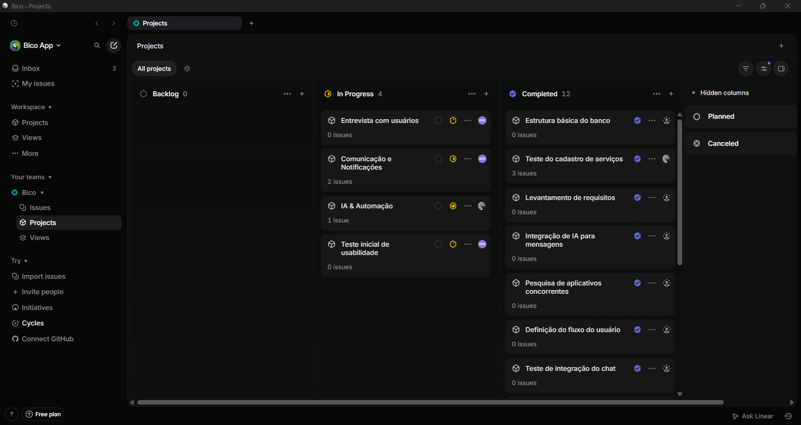

# Programação Web

Repositório central da disciplina, contendo resumos de todas as informações apresentadas em aula e detalhes do projeto semestral.

## Grupo

Gustavo de Oliveira e Lauren Campos.

## Projeto Semestral: Bico

O **Bico** é um aplicativo mobile focado em prestadores de serviço autônomos (como barbeiros, manicures, eletricistas, etc.). Ele utiliza Inteligência Artificial para apoiar nas vendas, gestão e retenção de clientes. A solução centraliza captação, agendamento, histórico e comunicação, ajudando o profissional a se organizar e vender melhor.

- **Repositório do projeto:** [tav0dev/bico](https://github.com/tav0dev/bico) *(ainda em desenvolvimento)*

> 📝 **Nota sobre a Documentação:** Diferente dos projetos semanais (que possuem documentação nos seus próprios repositórios no GitHub), a documentação teórica, evolução e concepção do Projeto Semestral (Bico) estão sendo centralizadas **aqui neste repositório**, divididas entre este README (como o quadro colaborativo abaixo) e os resumos das aulas (ex: concepção na Aula 02).

### Quadro Colaborativo

